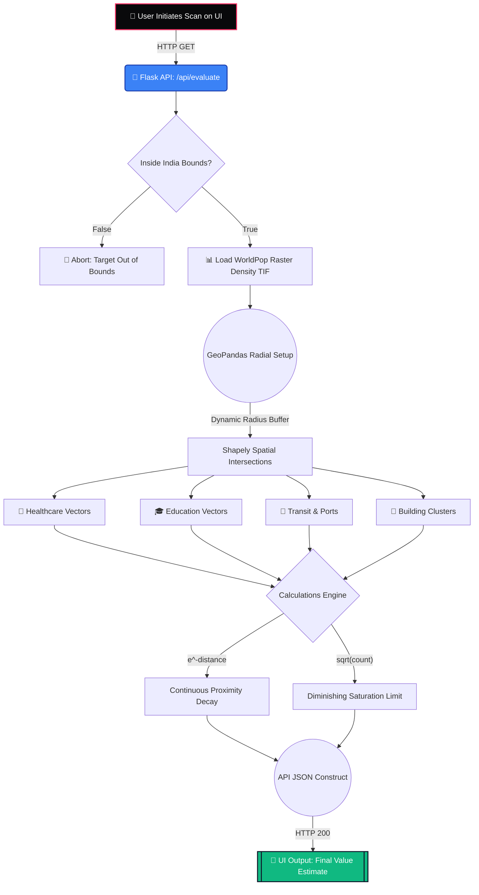

# 🗺️ GeoPredict Architect: Spatial Intelligence Framework

<div align="center">
  
  
  
  
  
  
</div>

<br/>

> **An advanced urban analytics engine designed to dynamically approximate real-estate valuation gradients strictly through topographical mathematics, infrastructural buffering, and population raster density.**

---

## 🔍 System Architecture Flow

The system operates on a decoupled **Frontend-to-Backend Full-Stack Architecture**. The Javascript UI captures coordinates and natively requests intersection mathematics from the local Flask API.



---

## 🛠️ Technology Stack
This application relies on high-grade data-science infrastructure completely hosted locally.
- **Web Server:** `Flask`, `Flask-CORS`
- **Spatial Processing:** `GeoPandas`, `Shapely`, `Fiona`, `PyProj`, `Rtree`
- **Raster Analytics:** `Rasterio`
- **Frontend Dashboard:** Vanilla `ES6 JavaScript`, `HTML5`, `CSS3`
- **Mapping APIs:** `Leaflet.js`, `CartoDB Positron Layers`

---

## 🧬 Algorithm & Mathematical Features

Unlike static real estate modules that rely on manual databases, **GeoPredict** leverages rigorous algorithmic constraints to simulate realistic market behaviors based on surroundings.

### 1. The Proximity Decay Theorem `e^(-dist)`
It abandons "range-binning" (e.g., arbitrarily deciding 900m is identical to 10m). Instead, it maps amenity relationships logarithmically. An airport 100 meters away severely scales value compared to an airport 5 kilometers away.

### 2. Root-Dampening (Saturation Economics)
To model diminishing returns in infrastructure impact, we cap exponential explosion. Specifically, if a zone has 20 clinics, it isn't mathematically 20x more valuable than a zone with 1 clinic. The engine processes multiple hotspots through a `sqrt(count)` dampening factor.

### 3. Variety Density Scoring
A neighborhood intersecting four distinct infrastructure profiles (Healthcare + Transit + School + Buildings) yields a massive **Variety Synthesis Overlay** bonus, reflecting mixed-zoning viability vs. barren single-use plots.

<br/>

## 📡 The Vanguard Interface

Because native mapping tools rely on predefined political borders that inject geopolitical issues, our frontend maps deploy **two transparently stacked layers**:
1. **ESRI World Imagery Layer**: Pure, high-resolution satellite topography.
2. **CartoDB Positron Vector Overlay**: Floating topological texts (Cities, Districts) stripped of controversial national boundary lines.

This provides an incredibly academic, Neo-Tactical layout driven by localized JSON logic.

---

## ⚠️ Spatial Blind Spots (Analytic Transparency)

No predictive spatial algorithm is flawless. To maintain academic and technical integrity, the following parameters are acknowledged limits of the model:

| Blind Spot | Analytic Constraint |
|:---:|:---|
| **Network Proximity** | Distances are currently processed **Euclidean (As-the-crow-flies)**. They do not simulate road-routing algorithms constraints or physical blockades like rivers intercepting the route. |
| **Zoning Restrictions** | While physical structures exist, the data lacks municipal zoning (Commercial vs. Agricultural) which unilaterally alters financial value overnight. |
| **Negative Externalities** | Currently, all infrastructure yields a net-positive scalar. Heavy fright-rail or massive industrial pollution zones should theoretically penalize residential valuations, yet count positively in raw mass scans. |

---

## 🚀 How To Run (Starting the Spatial Server)
Because this project utilizes over 1GB of raw Geographical boundaries mapped directly to an active REST API, it requires a local Python backend to process the math. This connects the pure frontend directly to the spatial raster datasets.

1. **Activate your environment & Install Backend Libraries**:
   ```bash
   pip install -r requirements.txt
   ```
2. **Ignite the Flask Engine**:
   ```bash
   python app.py
   ```
   *(Wait up to 30-60 seconds for the backend to cache the massive spatial geometries into server RAM)*
3. **Launch the Frontend**: Once the terminal reads `"Server Online! GeoPredict APIs active"`, leave the terminal running and simply double-click `frontend/index.html` in your web browser.

---

## 💾 Resource Acquisition

Due to rigorous spatial density and the constraints of standard IDE remote commits, the **HOTOSM** and **WorldPop** databases required to natively execute the backend algorithms are retained offline via Google Cloud Drive.
- 👉 **[Download Full Feature Dataset Here](https://drive.google.com/file/d/1drzNV2RqIDW2B5vz1EZKh0VYV_FdVAWA/view?usp=drive_link)**

---
_System Engineered for Next-Generation Terrain Analytics._
